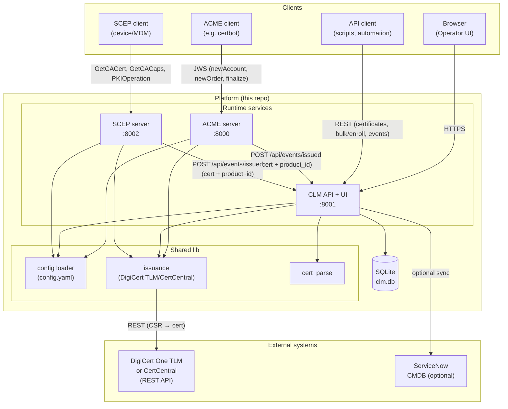
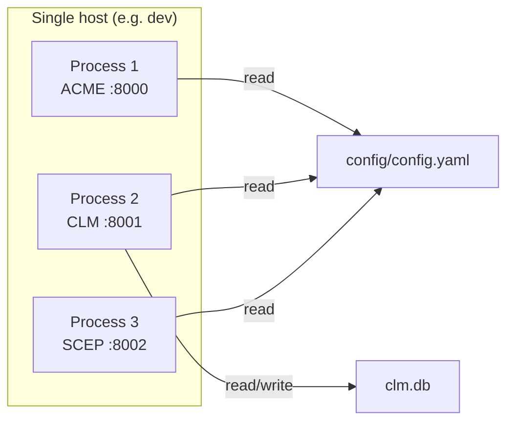

# ADR 0001: Platform Services Architecture and Network

## Status

**Accepted**

## Date

2025-03-10

## Context

We need a single-repo platform that provides:

- **ACME v2** server for certificate enrollment (RFC 8555), with `product_id` binding and automatic ingestion of issued certs into a lifecycle manager.
- **Certificate Lifecycle Manager (CLM)** to store and list certificates, support bulk enrollment and event ingestion, and optionally sync to ServiceNow CMDB.
- **SCEP** server for device/MDM enrollment (GetCACert, GetCACaps, PKIOperation).
- **REST API** for automation (certificates CRUD, bulk enroll, events).
- **Web UI** for operators to view certificates, run bulk enrollments, and view SCEP endpoints.

Issuance must be **CA-agnostic**: the same flows should work with DigiCert One TLM, DigiCert CertCentral, or other CAs by configuration. All services should be deployable as separate processes with clear network boundaries.

## Decision

We adopt a **multi-service, single-repo** architecture with three runtime services (ACME, CLM, SCEP), a shared library for issuance and config, and a React frontend. Configuration is file-based (YAML) with environment variable substitution. Issuance is centralized in `lib/issuance`, which calls the configured CA’s REST API (e.g. DigiCert One TLM or CertCentral).

### Network diagram

### Deployment / process view

- **ACME server** (port 8000): Serves `/directory`, `/new-nonce`, `/new-account`, `/new-order`, `/order/{id}`, `/finalize/{order_id}`, `/cert/{id}`, `/auth/{id}`. Uses in-memory store; on finalize calls `lib.issuance.issue_certificate()` then POSTs issued cert to `clm_ingest_url`.
- **CLM** (port 8001): FastAPI app. Serves `/health`, `/api/certificates` (GET/POST), `/api/certificates/{id}`, `/api/events/issued` (POST), `/api/bulk/enroll` (POST). Serves static UI from `frontend/dist` or `frontend/`. Uses SQLite (`clm.db`). Optionally pushes certificate records to ServiceNow when `servicenow.enabled` is true.
- **SCEP server** (port 8002): Serves `/GetCACert`, `/GetCACaps`, `/PKIOperation`. Uses `lib.issuance` for enrollment; POSTs issued cert to `clm_ingest_url`.
- **Shared lib**: `lib/config.py` (load config, env substitution), `lib/cert_parse.py` (PEM cert/CSR parsing), `lib/issuance.py` (CA-agnostic issuance: DigiCert One TLM, CertCentral).

### Data flow summary

| Flow | Trigger | Path | Backend CA | CLM ingest |
|------|---------|------|------------|------------|
| ACME enrollment | Client finalize with CSR | ACME → lib/issuance → DigiCert | Yes | POST to clm_ingest_url |
| Bulk enroll | POST /api/bulk/enroll | CLM → lib/issuance → DigiCert | Yes | Stored in CLM DB + event |
| SCEP enrollment | POST /PKIOperation | SCEP → lib/issuance → DigiCert | Yes | POST to clm_ingest_url |
| Ingest only | POST /api/certificates or /api/events/issued | Client → CLM | No | Stored in CLM DB |

### Ports and URLs (default)

| Service | Port | Default base URL |
|---------|------|-------------------|
| ACME | 8000 | http://localhost:8000 |
| CLM (API + UI) | 8001 | http://localhost:8001 |
| SCEP | 8002 | http://localhost:8002 |

All URLs are configurable via `config/config.yaml` (`app.acme_base_url`, `app.clm_base_url`, `app.clm_ingest_url`, `scep.base_url`).

### Security (current)

- **ACME**: Nonce replay protection only; no JWS signature verification in this prototype.
- **CLM API**: No authentication; CORS limited to localhost origins.
- **SCEP**: No client authentication.
- **TLS**: Not implemented in-app; production should run behind HTTPS (reverse proxy).
- **Secrets**: CA API keys and ServiceNow credentials come from config/env only.

See README “Security” and “Access control” sections for details and recommendations.

## Consequences

- **Single repo**: One codebase, one config schema; easier to keep ACME, CLM, and SCEP in sync. Trade-off: all services share the same release.
- **CA-agnostic issuance**: Adding a new CA requires a new adapter in `lib/issuance` and config entries; no change to ACME/CLM/SCEP route logic.
- **Separate processes**: ACME, CLM, and SCEP can be scaled or placed on different hosts; they communicate only via HTTP (CLM ingest URL) and shared config file.
- **No auth in-app**: Faster to run locally and integrate; production deployments must add auth (API keys, OAuth, Okta, etc.) and HTTPS as described in the README.

## References

- README.md – Quick start, configuration, security, access control.
- config/config.example.yaml – Full config sample with comments.
- lib/issuance.py – CA adapters (DigiCert One TLM, CertCentral).
